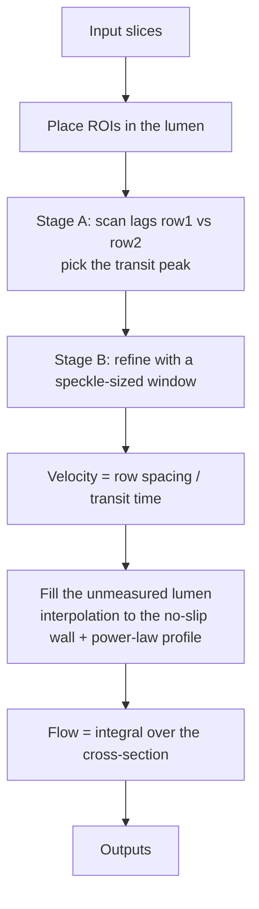

# flow_estimation

Through-plane blood flow estimation with a two-row (zipper) probe. The speckle
seen by row1 reappears at row2 after a transit time; velocity is the row
spacing divided by that time, and flow is its integral over the lumen.

## Pipeline

## Input

Per slice:

- Complex IQ images of row1 and row2 (depth × lateral × frames)
- Pixel grid (x, z) and frame interval
- Distance between the two rows and the elevation beam width
- Lumen centre and radius
- Flow direction (row1 → row2 or the reverse)

Optional: ground-truth velocity field (analytic or CFD), used only for scoring.

## Output

- Through-plane velocity at every ROI, with its correlation peak
- Reconstructed velocity field over the full lumen
- Velocity profile along the vessel diameter
- Flow rate per slice
- Error metrics (NRMSE, flow error, yield) when ground truth is given
